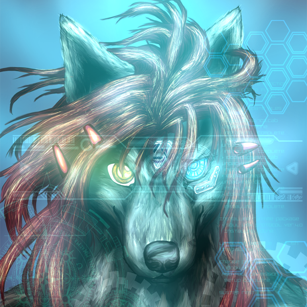

Name : SheilaGrace(シェーラ グレイス)

Theriotype : Low-content wolfdog (Mix of European Wolf, Alaskan Malamute, Kishu dog, and Shepard. 25% wolf blood contained)

Gender : Female (MtF Transgender) / Den mother

Born : Middle of 1980's

Belief : Both Spiritual and Psychological/Neurological Therianthropy, Japanese traditional Shinto especially Mitsumine Shrine

Specialty : Expert level essay or report writing, non-professional level 2D drawing, initiate level 3D modeling

Language : Expert level Japanese(Mother tongue), initiate level English

Characteristics of theriotype : Has both anthro and feral forms, depending on her mood or who to interact with. Has light-gray fur and wine-red long hair. Odd-eyed, the left is blue, representing her dog aspect, and the right is gold, representing her wolf aspect. Sometimes cybernetics parts are added mainly on her right arm to the shoulder, back, and neck, representing her past physical injury and aftereffects, but also reflecting her determination to overcome those handicaps.

Bio : Sheila was born in a certain famous car maker's company town. Her innate biological sex was male, but she showed some feminine behaviors from the early stages. But more prominently, she had really vivid therianthropic behaviors and recognition of 'I'm not a human but something else'.

Unfortunately for her, the atmosphere of Japan was strictly economy-centered in the 1980s and 1990s due to the after-effect Japanese bubble economy. Her particularly unique identity didn't fit in the era and place she was born. Naturally, she got frustrated because of the authoritarian atmosphere, spent her elementary school and junior high almost constantly bullied due to her unique identity. Her almost only salvation was spending her time in nature, creation, or her dog. Her therianthropic identity was shaped and sharpened with the antithesis against capitalism and authoritarianism.

Two dramatic encounters happened during her adolescence. One of those was "Kerberos Panzer Cop" of Mamoru Oshii, and the other one was the anthro wolf character 'Sierra' from "Legend of Mana". "Kerberos Panzer Cop" made her thought style solid, and 'Sierra' provided a concrete image of theriotype appearance. Her basic existence is built up in this moment.

She devoted herself to creation, mainly writing. She wrote an average of over 2 pages each day. Her theriotype image and personality were established through this. Also her writing style and skill were shaped during this constant writing.

When she was 18, she entered the writer's school to be a professional, but she gave up on her dream on the first day of class because her Sensei told her writers could never write what they wanted to write but only to follow the demands of consumers. She learned basic skills from some professional writers, but also it could be said her basic writing style was already established before she got teachings. Especially her therianthropic viewpoints and detailed or poetic explanation ability were no one else could achieve. But too sad no one could understand the worth of her literature in school, also not suited for entertainment or commercial use.

During this era, "Wolf's Rain" was released and made a huge inspiration to her. Also she encountered the concept of 'Furry' too, which was still in the dawn in Japan. She made several furry friends but many of them schemed sexual exploits. The experience of being sexually and emotionally abused almost directly triggered her to be aware of her true gender, but also became an almost direct reason to have a negative impression of furries.

After that she decided to go to computer technology school to be a web designer. And she tried to build up a creative community in the class to improve their skill together with her classmates. However, her project was disturbed due to an authoritarian teacher. Additionally, she was crucified in the famous anonymous web forum. These events graved incurable emotional wounds into her heart, directly dragged her to quit the school.

She decided to go to the university to gain vast knowledge. She was planning to make progress in gender therapy during school days. But it made huge opposition between her father, made her social withdrawal. But during this era, she got an ideal creative partner who understood her creativity and gender dysphoria. She decided to make permanent cooperation with her, but couldn't make legally assigned due to Japanese law restrictions. LGBT+'s understanding and acceptance were really not enough in Japan at that moment.

During her university days, she learned mainly Japanese history, literature, folklore, linguistics, librarism, and basic psychology. This vast knowledge had a huge influence on her life, contributed to expanding her viewpoint.

After a long struggle with her father, eventually she got support from her parents and had surgery. Finally she got her true gender legally but it was after she got into her 30s.

After that, her gender dysphoria was almost gone but instead her species dysphoria came up. She tried to seek a solution and found an English-based therian community. She was not that good at English at that moment but tried her best to communicate with global therians. That experience almost concluded her stance.

That is to say, her life itself is a therianthropic art.

